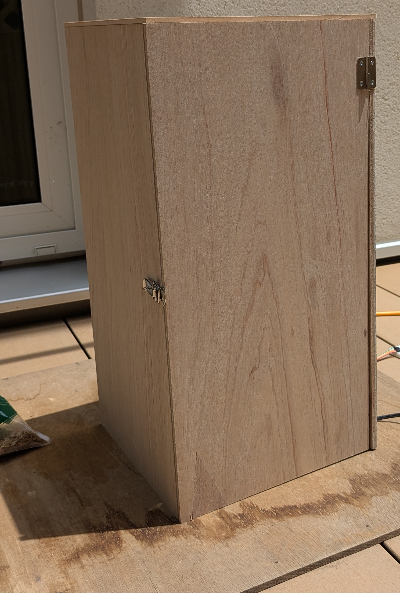
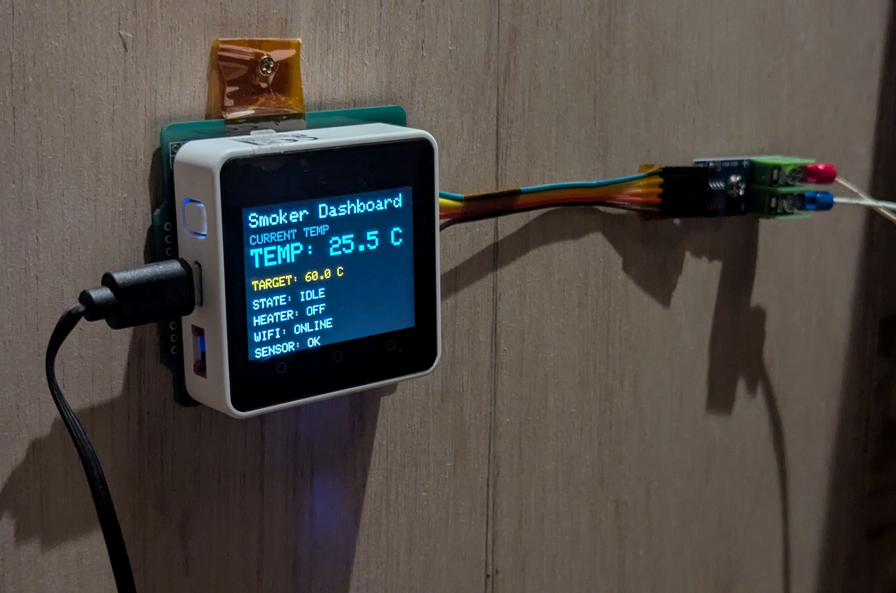
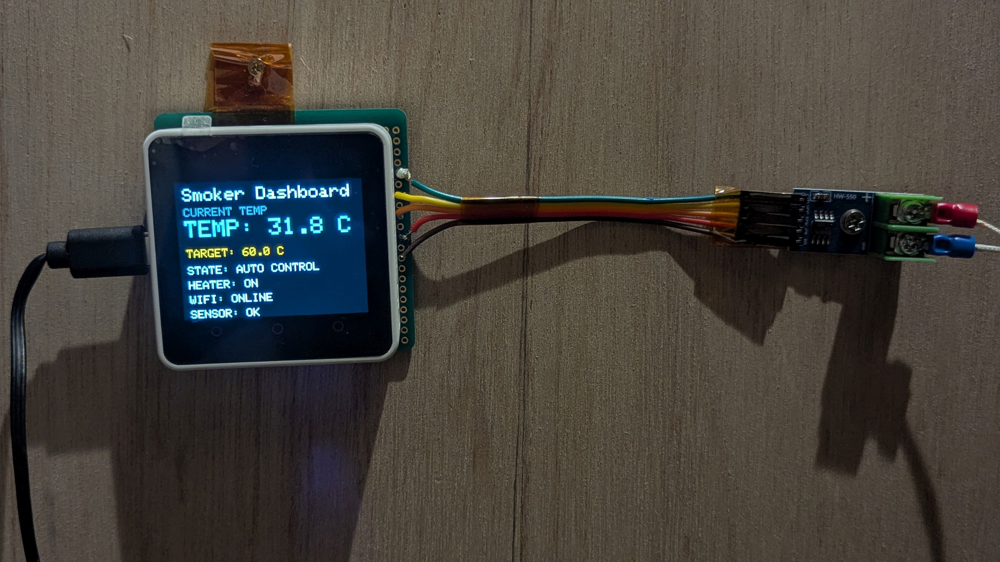
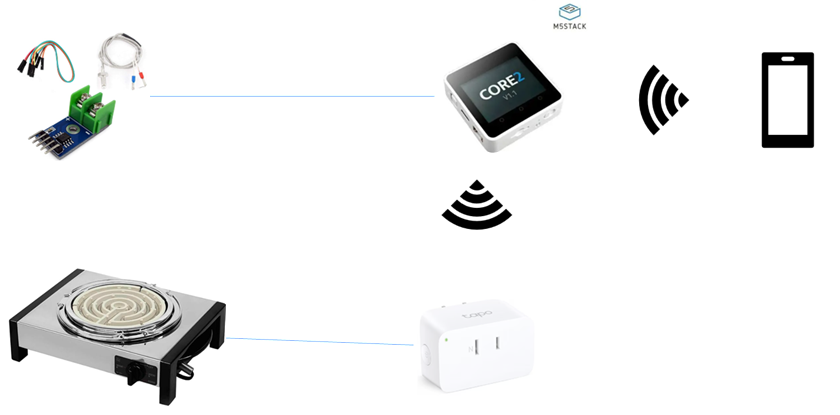
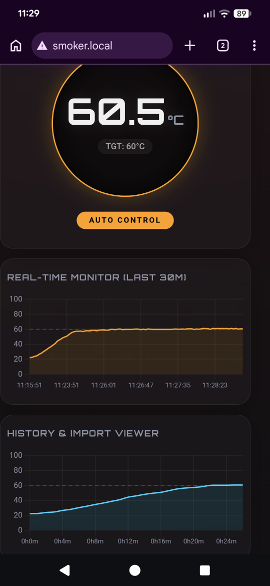
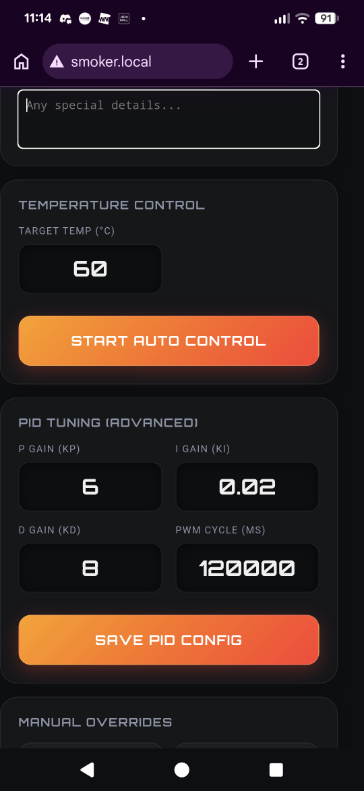

What started as a simple desire to prepare great snacks for a night of drinks with hacker friends gradually turned into a hands-on experiment in temperature-controlled smoking. I have long enjoyed smoking food as a hobby, but I often struggled with consistent temperature management. Too much heat could melt cheese, while too little heat could leave meat undercooked, which always raised food-safety concerns.

During early prototype runs, I tested control around 60 C. The system already worked, but cheese still softened more than expected. That result made one thing clear: this was not only about making something "work" once, but about creating a repeatable and practical cooking workflow.

What makes this project meaningful to me is the balance of practicality, safety, and customization. Instead of building a custom high-voltage control circuit from scratch, I used a smart plug as the actuator in a feedback-based system. A MAX6675 thermocouple monitors temperature, while the M5Stack Core2 runs control logic and sends commands to the plug. The Core2 also hosts a built-in web dashboard so users can monitor status and adjust settings directly from a browser.

M5Stack Core2 implements all temperature control, WebUI, and SmartPlug control.

Another key point was reliability under real conditions. Integrating sensor reads, heater control, local networking, and on-device UI required careful debugging and architecture tuning. I treated each issue as a design constraint and refined the system step by step until the behavior became predictable enough for daily use.

For technical implementation details, please see the GitHub repository (https://github.com/mn-se/smoker).

Setup was also important. Manual entry of Meross UUID/KEY/IP can be error-prone, so I prepared a helper script that can fetch and apply device information automatically. This lowers the barrier for non-technical users and reduces setup mistakes.
For reproducible setup steps, see tools/README.md in the GitHub repository.

Network settings and temperature-control feedback parameters can be changed from the WebUI.
Temperature and smoking logs can also be stored and read back. Going forward, I plan to strengthen how this data is accumulated so the platform can better support users who want to fine-tune and explore their own process.

In the end, this project became more than a one-off prototype. It showed that a smart-plug-based feedback loop can manage smoking safely and consistently while remaining accessible. By consolidating temperature control, heater actuation, and browser-based monitoring around M5Stack Core2, I was able to build a polished user experience that I actually enjoy using.

In Nagano, Japan, where I live, sake, wine, and whisky are part of everyday life. I hope the Hackster community can enjoy both the technical approach and the practical story behind this build.

---

ある夜、ハッカー仲間とおいしいお酒を楽しむためのつまみを用意することから、このプロジェクトは始まりました。私はもともと燻製を趣味として楽しんでいましたが、温度管理を安定して行うのが難しく、試行錯誤を重ねてきました。熱が強すぎるとチーズが溶け、逆に弱すぎると肉への加熱が不十分になる不安があり、実用面と安全面の両方で課題を感じていました。

試作段階では、おおよそ60℃で制御を試し、動作自体は確認できました。ただ、チーズはまだ少し溶け気味でした。この結果から、単に「動く」だけでなく、再現性のある温度制御と使い続けられる運用性が必要だと強く感じました。

このプロジェクトの面白さは、実用性・安全性・カスタマイズ性のバランスにあります。高リスクの電力制御回路をゼロから設計する代わりに、スマートプラグをアクチュエータとして使うフィードバック制御を採用しました。MAX6675 熱電対で温度を計測し、M5Stack Core2 が制御ロジックを実行して加熱源を調整します。さらに Core2 自身が Web ダッシュボードを公開するため、ブラウザから状態確認や設定変更ができ、現場での扱いやすさも高められました。

M5Stack Core2は温度制御, WebUI, SmartPlug制御をすべて実装しています。

開発では、センサー読み取り、ヒーター制御、ネットワーク通信、表示更新を同時に安定動作させる点に苦労しました。しかし問題を一つずつ設計上の制約として受け止め、原因を切り分けながら改善を積み上げることで、日常運用できる安定性に近づけることができました。

技術的な実装詳細は GitHub リポジトリ（https://github.com/mn-se/smoker）を参照してください。

セットアップ面も重視しています。Meross の UUID / KEY / IP を手入力するとミスが起きやすいため、デバイス情報を自動取得して反映できる補助スクリプトを用意しました。これにより、非エンジニアでも導入しやすく、初期設定の失敗を減らせます。
再現手順は  GitHub リポジトリの tools/README.md を参照してください。

ネットワーク設定、温度制御のフィートバックパラメータはWebUIから変更可能です。
温度や燻製のログも保存、読み出しが可能です。今後はこうしたデータの蓄積を強化して、
ユーザーの追求したい気持ちに寄り添いたいと考えています。

結果として、このプロジェクトは単なる実験ではなく、実際に使えるプラットフォームとして成立しました。スマートプラグを用いたフィードバック制御で、燻製工程を安全かつ再現性高く管理できることを示し、M5Stack Core2 を中心に制御・可視化・操作を統合することで、完成度の高い体験を実現できました。

私の住む日本の長野は日本酒やワイン、ウイスキーも美味しい土地です。ぜひ Hackster コミュニティの皆さんにも、このプロジェクトの背景と、作って使う楽しさの両方を感じてもらえたら嬉しいです。