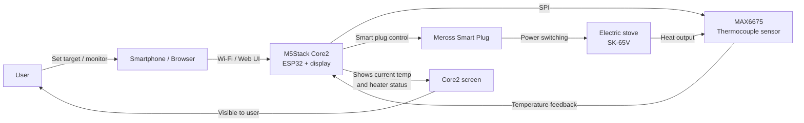
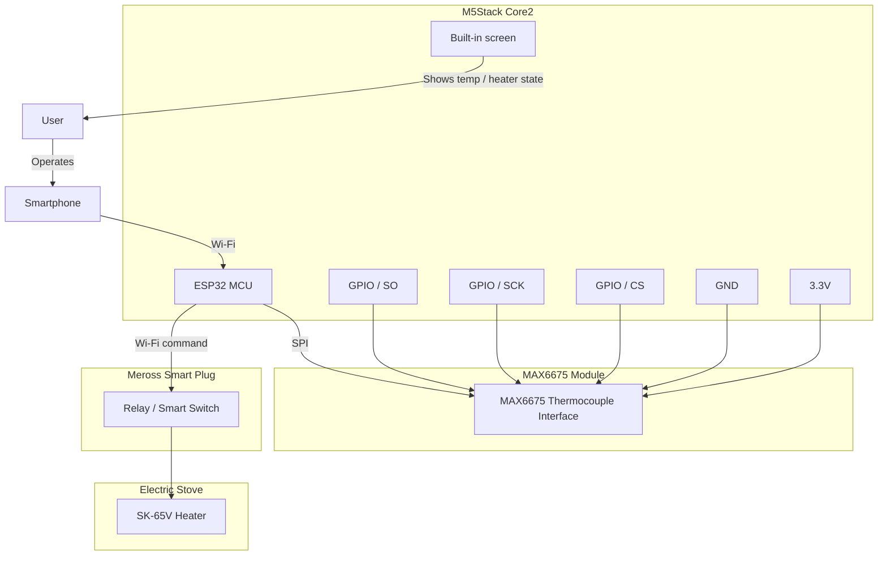
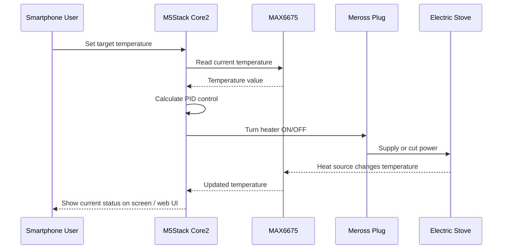

# Schematics and Circuit Diagrams

This file contains conceptual Mermaid diagrams for the Smoker project.

> These diagrams are for system-level understanding and prototyping. Any real mains wiring for the electric stove should be handled with appropriate safety precautions and local electrical standards.

## 1. System Overview

## 2. Conceptual Wiring Diagram

## 3. Control Flow

